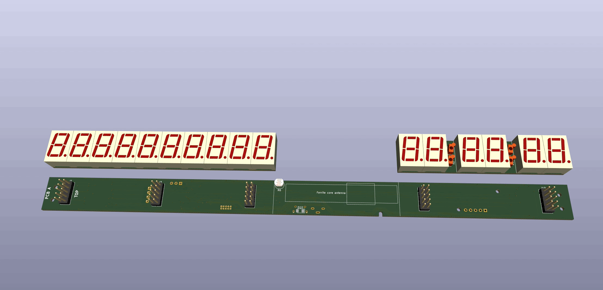

# Radio Controlled Clock

This project contains a custom designed wall clock that syncs to the DCF77
atomic time broadcast radio signal from Germany to ensure accuracy at all
times. There are no buttons to set the time manually.

